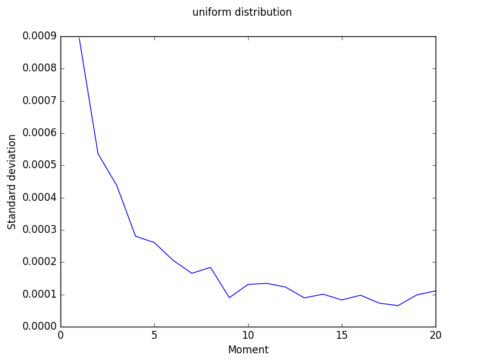
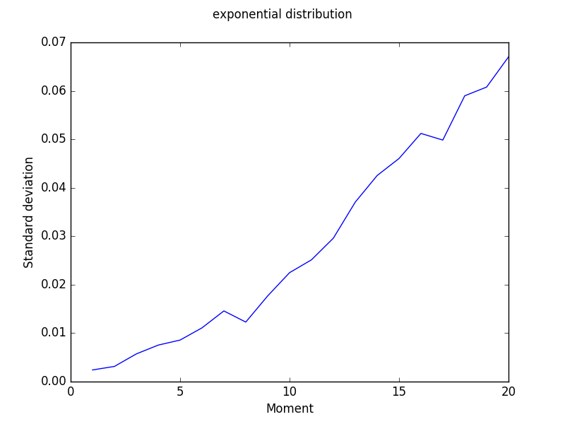

# mathstat-hw-method-of-moments
Homework for math statistics course in HSE

## Results

See the code in [hw.py](hw.py). You may invoke it to see the parameters.

The sample results for theta = 0.5, k = 1...20, sample size = 100 and number of experiments = 100 are over there:

